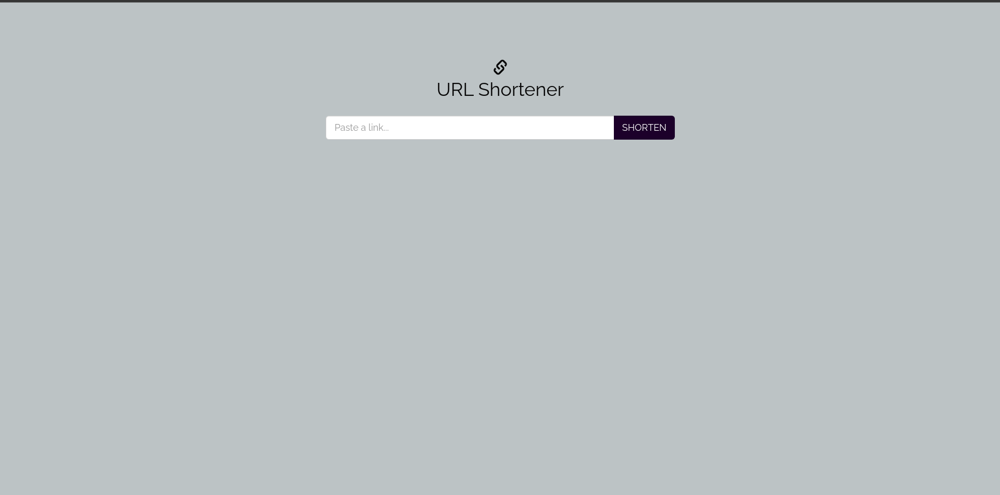
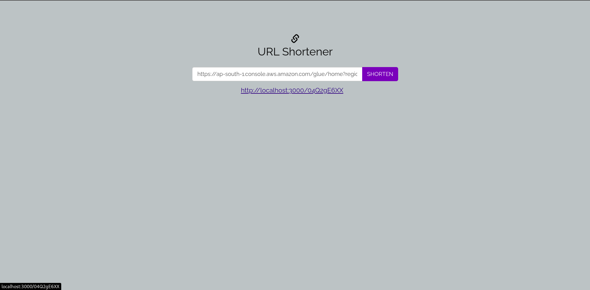

# URL Shortener

A simple web application built with Node.js, Express, and MongoDB for you to readily get a shortened URL to use

## Features

- User can input a set of URL aiming to be shortened
- User can get a alert message for invalid URL format input
- User can get a set of shortened URL from the original URL provided
- User can be redirected to the original URL by visiting the shortened URL

## Website preview

### Home page


### After getting shorten URL


## Built Using

- [NodeJs](https://nodejs.org/en/) - Server Environment
- [Express](https://expressjs.com/) - Server Framework
- [MongoDB](https://www.mongodb.com/) - Database


## Installing

The following instructions will get you a copy of the project and all the setting needed to run it on your local machine.

### Clone

Clone this repository to your local machine


```
$ git clone https://github.com/arpitptl/url-shortner.git
```


### Setup

**1. Enter the project folder**

```
$ cd url-shortener
```

**2. Install npm packages**

```
$ npm install
```

**3. Activate the server**

```
$ npm run dev
```

## Running the tests <a name = "tests"></a>

Explain how to run the automated tests for this system.
